# MobileDevices-GraphDB

*[Polish version (Wersja polska)](README_pl.md)*

## 1. Project Overview
MobileDevices-GraphDB is a Neo4j graph database containing mobile device data. The database stores 833 devices from 6 manufacturers with complete technical specifications.

**Database Contents:**
- 833 devices (729 phones, 69 tablets, 36 smartwatches)
- 6 companies: Samsung (299), Motorola (191), Redmi (147), Xiaomi (96), Realme (59), Huawei (43)
- 9 node types with technical specifications
- 8 relationship types connecting devices to specifications

**Key Features:**
- **Separate nodes for each capacity** - each RAM/Storage capacity is a distinct node
- Star structure - Device at center, specifications around it
- No device-to-device relationships - eliminates performance issues
- Completeness: 99.8% devices have batteries, 98.5% have RAM

**Technologies:**
- Neo4j - graph database
- Cypher - query language
- CSV - input data format

## 2. Database Overview


The graph above shows the overall database view displaying node diversity and their interconnections. The database structure is based on the central role of Device nodes, which connect to all types of technical specifications.

## 3. Database Nodes

### 3.1 Company
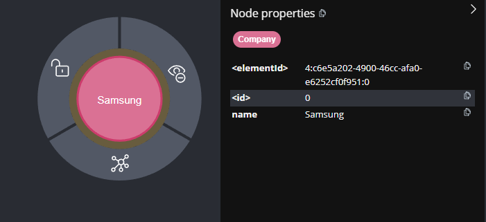

**Description:** Represents mobile device manufacturing companies.

**Properties:**
- `name` (String) - Company name (e.g., "Samsung", "Xiaomi")

**Statistics:** 6 companies in database

### 3.2 Device
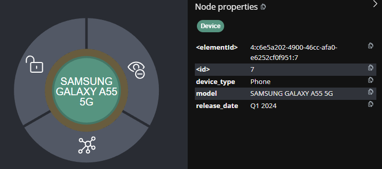

**Description:** Central node representing a mobile device - phone, tablet, or smartwatch.

**Properties:**
- `model` (String) - Device model (e.g., "SAMSUNG GALAXY F55")
- `release_date` (String) - Release date (e.g., "Q2 2024")
- `device_type` (String) - Device type (Phone/Tablet/Smartwatch)

**Statistics:** 833 devices (729 Phone, 69 Tablet, 36 Smartwatch)

**Note:** Manufacturer information is available through the `[:PRODUCED_BY]` relationship with Company node.

### 3.3 RAM
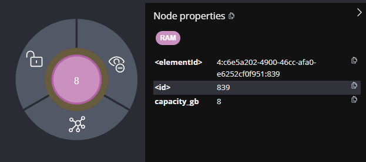

**Description:** Represents specific RAM memory capacity. Each node is one capacity.

**Properties:**
- `capacity_gb` (Integer) - Capacity in GB (e.g., 8, 12, 16)

**Example capacities:** 1GB, 2GB, 3GB, 4GB, 6GB, 8GB, 12GB, 16GB, 24GB

**Structure:** Devices with multiple RAM options have multiple `[:HAS_RAM]` relationships to different RAM nodes.

### 3.4 Storage
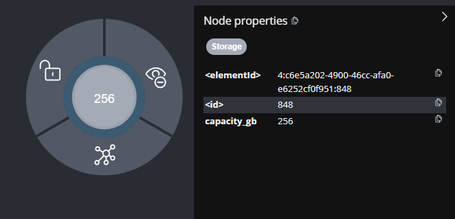

**Description:** Represents specific internal storage capacity. Each node is one capacity.

**Properties:**
- `capacity_gb` (Integer) - Capacity in GB (e.g., 128, 256, 512)

**Example capacities:** 8GB, 16GB, 32GB, 64GB, 128GB, 256GB, 512GB, 1024GB (1TB)

**Conversion:** System automatically converts TB to GB (1 TB = 1024 GB).

### 3.5 Battery
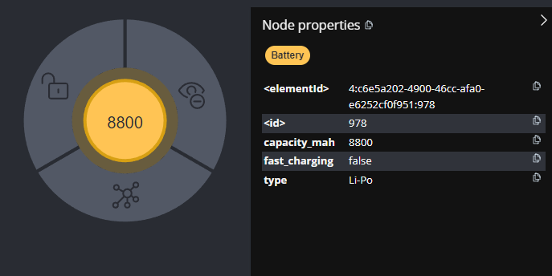

**Description:** Represents device battery specification.

**Properties:**
- `type` (String) - Battery type (Li-Ion/Li-Po/Unknown)
- `capacity_mah` (Integer) - Capacity in mAh (e.g., 5000)
- `fast_charging` (Boolean) - Fast charging support

**Capacity range:** From 240 mAh (smartwatches) to 11200 mAh (tablets).

### 3.6 Camera
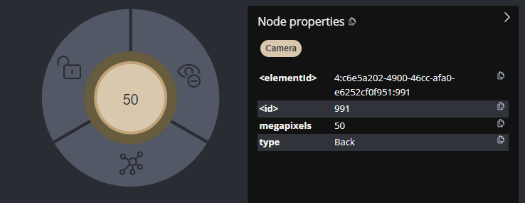

**Description:** Represents device camera - front or back as separate nodes.

**Properties:**
- `type` (String) - Camera type (Front/Back)
- `megapixels` (Integer) - Number of megapixels

**Separation:** Each device can have up to 2 Camera nodes (front + back).

### 3.7 Screen
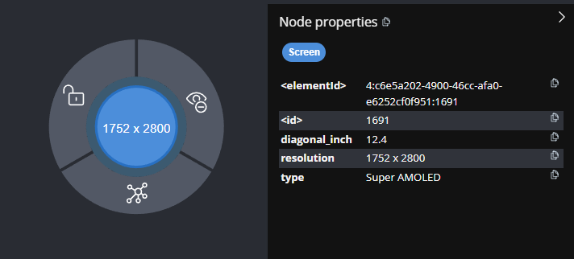

**Description:** Represents device screen specification.

**Properties:**
- `diagonal_inch` (Float) - Diagonal in inches (e.g., 6.7)
- `type` (String) - Screen type (e.g., "Super AMOLED")
- `resolution` (String) - Resolution (e.g., "1080 x 2400")

**Parsing:** System parses complex descriptions from CSV (e.g., "6.7" Super AMOLED 1080 x 2400 px").

### 3.8 Processor
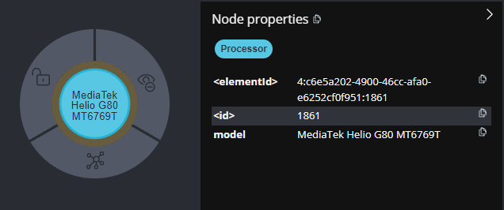

**Description:** Represents device processor.

**Properties:**
- `model` (String) - Full processor name (e.g., "Qualcomm Snapdragon 7 Gen 1")

**Most popular:** Snapdragon 8 Gen 2 (30 devices), Dimensity 700 (28 devices).

### 3.9 PhysicalProperties
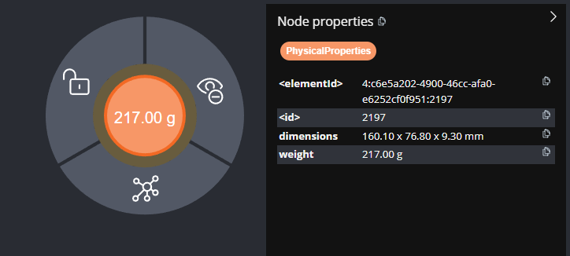

**Description:** Represents device dimensions and weight.

**Properties:**
- `dimensions` (String) - Dimensions (e.g., "163.90 x 76.50 x 7.80 mm")
- `weight` (String) - Weight (e.g., "180.00 g")

## 4. Database Relationships

**Basic specification relationships:**
- `PRODUCED_BY` - Device → Company (manufacturer)
- `HAS_RAM` - Device → RAM (memory)
- `HAS_STORAGE` - Device → Storage (internal storage)
- `HAS_BATTERY` - Device → Battery (battery)
- `HAS_CAMERA` - Device → Camera (camera)
- `HAS_SCREEN` - Device → Screen (screen)
- `HAS_PROCESSOR` - Device → Processor (processor)
- `HAS_PHYSICAL_PROPERTIES` - Device → PhysicalProperties (dimensions/weight)

**Relationship structure:**
All relationships have a star structure with Device node at center:
- 1 device → 8 specification types
- **Devices with multiple options** have multiple relationships of the same type (e.g., multiple `[:HAS_RAM]`)
- No device-to-device relationships (eliminates performance issues)

## 5. Basic Structure - Device Example
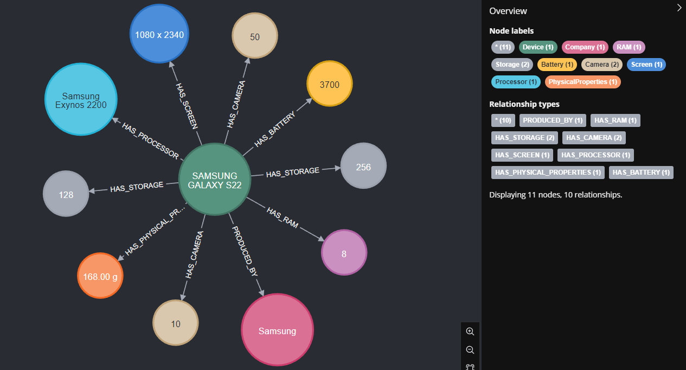

```cypher
MATCH (d:Device {model: 'SAMSUNG GALAXY F55'}) 
OPTIONAL MATCH (c:Company)<-[:PRODUCED_BY]-(d)
OPTIONAL MATCH (d)-[:HAS_RAM]->(ram:RAM) 
OPTIONAL MATCH (d)-[:HAS_STORAGE]->(storage:Storage)
OPTIONAL MATCH (d)-[:HAS_BATTERY]->(battery:Battery) 
OPTIONAL MATCH (d)-[:HAS_CAMERA]->(camera:Camera) 
OPTIONAL MATCH (d)-[:HAS_SCREEN]->(screen:Screen) 
OPTIONAL MATCH (d)-[:HAS_PROCESSOR]->(processor:Processor) 
OPTIONAL MATCH (d)-[:HAS_PHYSICAL_PROPERTIES]->(pp:PhysicalProperties)
RETURN d, c, ram, storage, battery, camera, screen, processor, pp;
```

**Structure description:**
Graph shows star architecture:
- **Center:** Samsung Galaxy F55 (Device)
- **Capacity relationships:** Separate connections to RAM (8GB, 12GB) and Storage (256GB)
- **Specifications:** 6.7" Super AMOLED screen, 5000 mAh Li-Po battery, 50+50 MP cameras

## 6. Example Queries

### Premium phones with best specifications
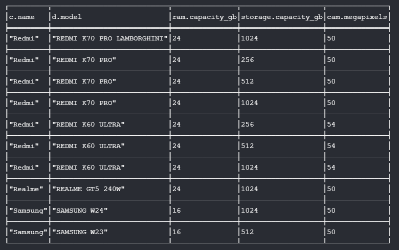
```cypher
MATCH (d:Device {device_type: 'Phone'})-[:HAS_RAM]->(ram:RAM)
MATCH (d)-[:HAS_STORAGE]->(storage:Storage)
MATCH (d)-[:HAS_CAMERA]->(cam:Camera {type: 'Back'})
MATCH (d)-[:PRODUCED_BY]->(c:Company)
WHERE ram.capacity_gb >= 12 AND storage.capacity_gb >= 256 AND cam.megapixels >= 50
RETURN c.name, d.model, ram.capacity_gb, storage.capacity_gb, cam.megapixels
ORDER BY ram.capacity_gb DESC
LIMIT 10;
```

### Specification comparison between manufacturers
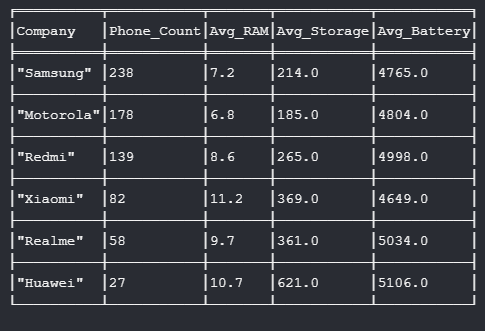
```cypher
MATCH (d:Device {device_type: 'Phone'})-[:PRODUCED_BY]->(c:Company)
MATCH (d)-[:HAS_RAM]->(ram:RAM)
MATCH (d)-[:HAS_STORAGE]->(storage:Storage)
MATCH (d)-[:HAS_BATTERY]->(battery:Battery)
WITH c.name as Company, d,
     max(ram.capacity_gb) as max_ram,
     max(storage.capacity_gb) as max_storage,
     battery.capacity_mah as battery_capacity
RETURN Company,
       count(d) as Phone_Count,
       round(avg(max_ram), 1) as Avg_RAM,
       round(avg(max_storage), 0) as Avg_Storage,
       round(avg(battery_capacity), 0) as Avg_Battery
ORDER BY Phone_Count DESC;
```

### Samsung devices from 2024 with multiple memory options
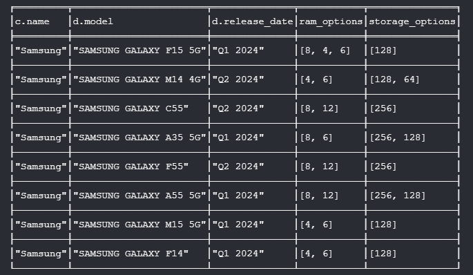
```cypher
MATCH (d:Device)-[:HAS_RAM]->(ram:RAM)
MATCH (d)-[:HAS_STORAGE]->(storage:Storage)
MATCH (d)-[:PRODUCED_BY]->(c:Company {name: 'Samsung'})
WHERE d.release_date CONTAINS '2024'
WITH d, c, 
     collect(DISTINCT ram.capacity_gb) as ram_options,
     collect(DISTINCT storage.capacity_gb) as storage_options
WHERE size(ram_options) > 1 OR size(storage_options) > 1
RETURN c.name, d.model, d.release_date, ram_options, storage_options
ORDER BY size(ram_options) DESC
LIMIT 8;
```

### Phones with largest AMOLED screens - 2023
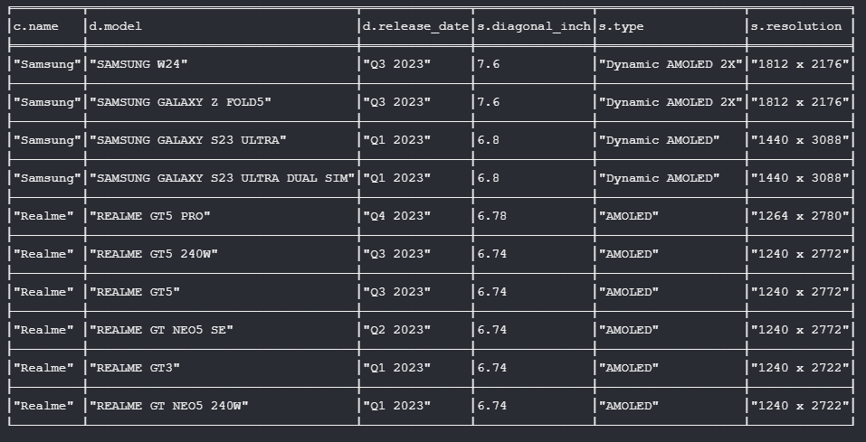
```cypher
MATCH (d:Device)-[:HAS_SCREEN]->(s:Screen)
MATCH (d)-[:PRODUCED_BY]->(c:Company)
WHERE s.type CONTAINS 'AMOLED' AND d.release_date CONTAINS '2023'
  AND d.device_type = 'Phone'
RETURN c.name, d.model, d.release_date, s.diagonal_inch, s.type, s.resolution
ORDER BY s.diagonal_inch DESC
LIMIT 10;
```

### Samsung phones with Snapdragon processors
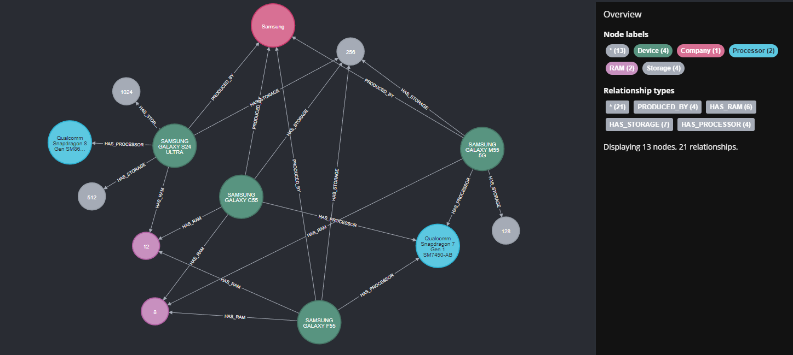
```cypher
MATCH (d:Device {device_type: 'Phone'})-[:PRODUCED_BY]->(c:Company {name: 'Samsung'})
MATCH (d)-[:HAS_PROCESSOR]->(p:Processor)
MATCH (d)-[:HAS_RAM]->(ram:RAM)
MATCH (d)-[:HAS_STORAGE]->(storage:Storage)
WHERE p.model CONTAINS 'Snapdragon' AND d.release_date CONTAINS '2024'
  AND ram.capacity_gb >= 8
RETURN d, c, p, ram, storage;
```

### Samsung Galaxy S21 family devices
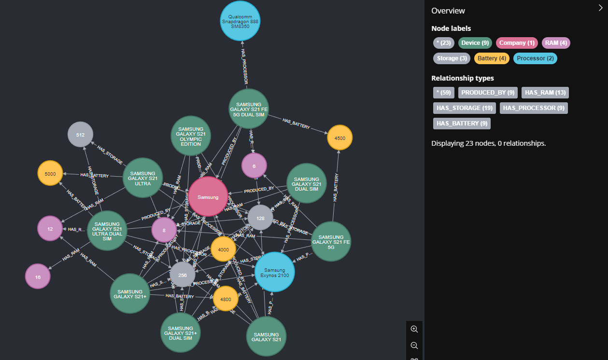
```cypher
MATCH (d:Device)-[:PRODUCED_BY]->(c:Company {name: 'Samsung'})
WHERE d.model STARTS WITH 'SAMSUNG GALAXY S21'
OPTIONAL MATCH (d)-[:HAS_RAM]->(ram:RAM)
OPTIONAL MATCH (d)-[:HAS_STORAGE]->(storage:Storage)
OPTIONAL MATCH (d)-[:HAS_BATTERY]->(battery:Battery)
OPTIONAL MATCH (d)-[:HAS_PROCESSOR]->(processor:Processor)
RETURN d, c, ram, storage, battery, processor
LIMIT 15;
```

### Tablets with best batteries - flagship models
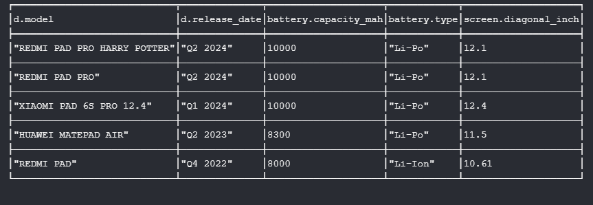
```cypher
MATCH (d:Device {device_type: 'Tablet'})-[:HAS_BATTERY]->(battery:Battery)
MATCH (d)-[:HAS_SCREEN]->(screen:Screen)
WHERE battery.fast_charging = true AND screen.diagonal_inch >= 10
  AND battery.capacity_mah >= 7000
RETURN d.model, d.release_date, battery.capacity_mah, battery.type, screen.diagonal_inch
ORDER BY battery.capacity_mah DESC;
```

## 7. Installation and Setup

**Requirements:**
- Neo4j Desktop 1.5.0+
- phone_data.csv file

**Installation steps:**

1. **Clone repository:**
```bash
git clone https://github.com/[username]/MobileDevices-GraphDB.git
cd MobileDevices-GraphDB
```

2. **Create database in Neo4j Desktop:**
   - Open Neo4j Desktop
   - Create new project "MobileDevices-GraphDB"
   - Add database (password: password123)

3. **Upload CSV file:**
   - Copy phone_data.csv to database import/ folder

4. **Run import:**
   - Open Neo4j Browser
   - Copy and run code from scripts/database_import.cypher

5. **Verify import:**
```cypher
MATCH (n) 
RETURN labels(n)[0] as NodeType, count(n) as Count
ORDER BY Count DESC;
```

## 8. Technical Specification

**Database characteristics:**
- **Nodes:** ~1,200 total (833 Device + ~370 specifications)
- **Relationships:** ~6,600 total (star structure)
- **Performance:** Capacity queries in <100ms
- **Completeness:** 99.8% batteries, 98.5% RAM, 97.3% processors

**Main structural features:**
- **RAM/Storage:** Separate nodes for each capacity (eliminates redundancy)
- **Relationships:** Devices with multiple options have multiple relationships of same type
- **Star structure:** Device at center, specifications around

**Analytical capabilities:**
- Simple queries for specific capacities
- Analysis of configuration popularity
- Easy comparisons between manufacturers
- Efficient searching by memory criteria

**Limitations:**
- No price and availability data
- Only 6 major manufacturers
- Data from 2020-2024 period

## 9. File Structure

```
MobileDevices-GraphDB/
├── README.md                  # This file - project documentation
├── README_pl.md              # Polish version of documentation
├── data/
│   └── phone_data.csv        # Source mobile device data
├── scripts/
│   └── database_import.cypher # Data import script for Neo4j
├── images/               # Screenshots
│   ├── database_overview.png
│   ├── device_structure.png
│   ├── nodes_*.png       # Node diagrams
│   └── query_*.png       # Example query results
└── examples/
    ├── basic_queries.md      # Basic Cypher queries
    ├── advanced_analysis.md  # Advanced analytics
    └── visualization_examples.md # Visualization examples
```

**Main directory descriptions:**
- `data/` - CSV files with device data
- `scripts/` - Import and configuration scripts
- `images/` - Screenshots
- `examples/` - Usage examples and queries

MobileDevices-GraphDB is an optimized graph database with data on 833 mobile devices, utilizing an efficient structure of separate nodes for memory capacities.
