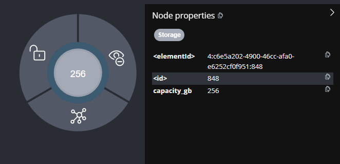
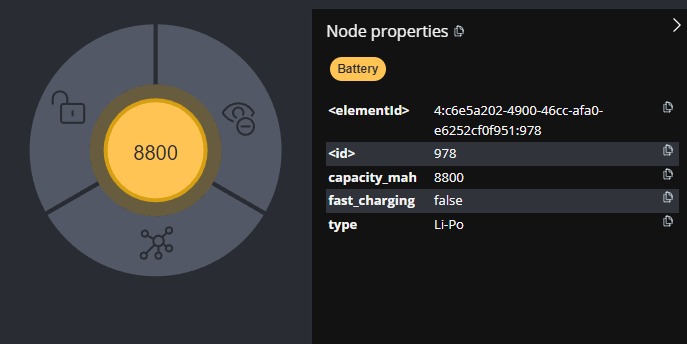
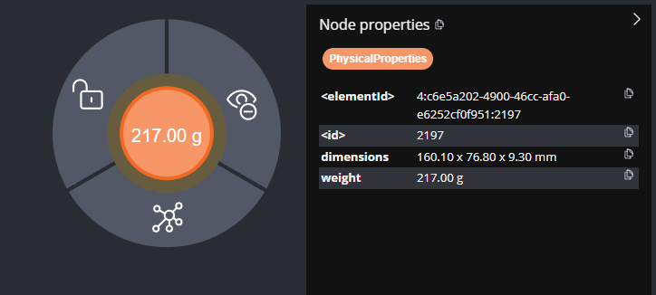
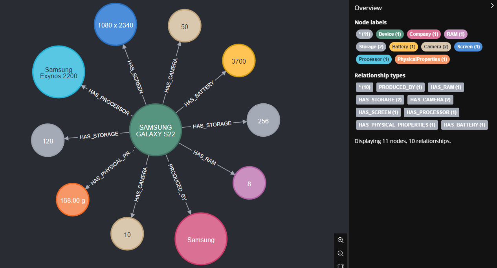
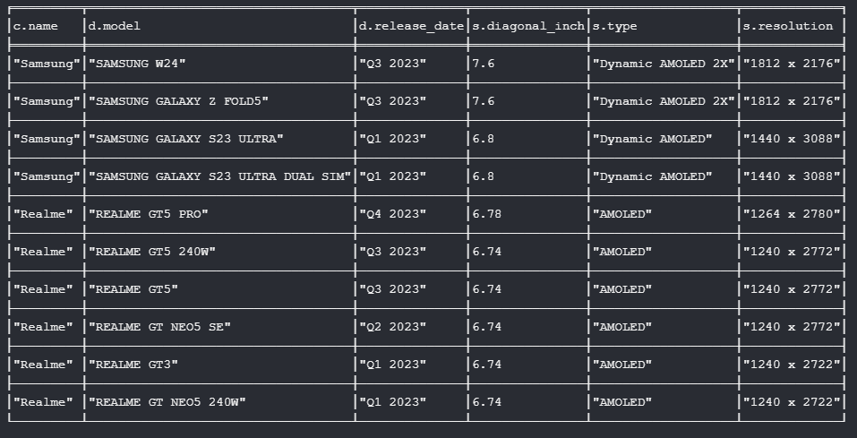
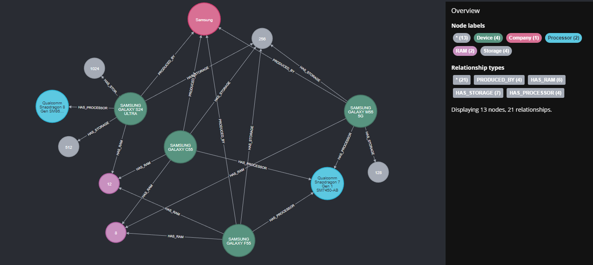
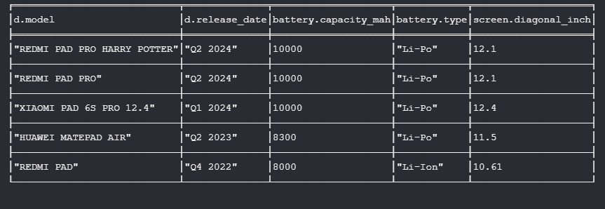

# MobileDevices-GraphDB

*[English version (Wersja angielska)](README.md)*

## 1. Opis projektu
MobileDevices-GraphDB to baza grafowa w Neo4j zawierająca dane o urządzeniach mobilnych. Baza przechowuje 833 urządzenia od 6 producentów z pełnymi specyfikacjami technicznymi.

**Dane w bazie:**
- 833 urządzenia (729 telefony, 69 tablety, 36 smartwatche)
- 6 firm: Samsung (299), Motorola (191), Redmi (147), Xiaomi (96), Realme (59), Huawei (43)
- 9 typów węzłów z specyfikacjami technicznymi
- 8 typów relacji łączących urządzenia ze specyfikacjami

**Kluczowe rozwiązania:**
- **Osobne węzły dla każdej pojemności** - każda pojemność RAM/Storage to oddzielny węzeł
- Struktura gwiazdy - Device w centrum, specyfikacje dookoła
- Brak relacji urządzenie-urządzenie - eliminuje problemy wydajnościowe
- Kompletność: 99.8% urządzeń ma baterie, 98.5% ma RAM

**Technologie:**
- Neo4j - baza grafowa
- Cypher - język zapytań
- CSV - format danych wejściowych

## 2. Przegląd całej bazy danych


Powyższy graf przedstawia ogólny widok bazy danych pokazujący różnorodność węzłów i ich wzajemne połączenia. Struktura bazy opiera się na centralnej roli węzłów Device, które łączą się z wszystkimi typami specyfikacji technicznych.

## 3. Węzły bazy danych

### 3.1 Company (Firma)


**Opis:** Reprezentuje firmy produkujące urządzenia mobilne.

**Właściwości:**
- `name` (String) - Nazwa firmy (np. "Samsung", "Xiaomi")

**Statystyki:** 6 firm w bazie danych

### 3.2 Device (Urządzenie)


**Opis:** Centralny węzeł reprezentujący urządzenie mobilne - telefon, tablet lub smartwatch.

**Właściwości:**
- `model` (String) - Model urządzenia (np. "SAMSUNG GALAXY F55")
- `release_date` (String) - Data wydania (np. "Q2 2024")
- `device_type` (String) - Typ urządzenia (Phone/Tablet/Smartwatch)

**Statystyki:** 833 urządzenia (729 Phone, 69 Tablet, 36 Smartwatch)

**Uwaga:** Informacja o producencie jest dostępna przez relację `[:PRODUCED_BY]` z węzłem Company.

### 3.3 RAM (Pamięć operacyjna)


**Opis:** Reprezentuje konkretną pojemność pamięci RAM. Każdy węzeł to jedna pojemność.

**Właściwości:**
- `capacity_gb` (Integer) - Pojemność w GB (np. 8, 12, 16)

**Przykłady pojemności:** 1GB, 2GB, 3GB, 4GB, 6GB, 8GB, 12GB, 16GB, 24GB

**Struktura:** Urządzenia z wieloma opcjami RAM mają wiele relacji `[:HAS_RAM]` do różnych węzłów RAM.

### 3.4 Storage (Pamięć wewnętrzna)


**Opis:** Reprezentuje konkretną pojemność pamięci wewnętrznej. Każdy węzeł to jedna pojemność.

**Właściwości:**
- `capacity_gb` (Integer) - Pojemność w GB (np. 128, 256, 512)

**Przykłady pojemności:** 8GB, 16GB, 32GB, 64GB, 128GB, 256GB, 512GB, 1024GB (1TB)

**Konwersja:** System automatycznie konwertuje TB na GB (1 TB = 1024 GB).

### 3.5 Battery (Bateria)


**Opis:** Reprezentuje specyfikację baterii urządzenia.

**Właściwości:**
- `type` (String) - Typ baterii (Li-Ion/Li-Po/Unknown)
- `capacity_mah` (Integer) - Pojemność w mAh (np. 5000)
- `fast_charging` (Boolean) - Obsługa szybkiego ładowania

**Zakres pojemności:** Od 240 mAh (smartwatche) do 11200 mAh (tablety).

### 3.6 Camera (Aparat)


**Opis:** Reprezentuje aparat urządzenia - przedni lub tylny jako osobne węzły.

**Właściwości:**
- `type` (String) - Typ aparatu (Front/Back)
- `megapixels` (Integer) - Liczba megapikseli

**Rozdzielenie:** Każde urządzenie może mieć do 2 węzłów Camera (przedni + tylny).

### 3.7 Screen (Ekran)


**Opis:** Reprezentuje specyfikację ekranu urządzenia.

**Właściwości:**
- `diagonal_inch` (Float) - Przekątna w calach (np. 6.7)
- `type` (String) - Typ ekranu (np. "Super AMOLED")
- `resolution` (String) - Rozdzielczość (np. "1080 x 2400")

**Parsing:** System parsuje złożone opisy z CSV (np. "6.7" Super AMOLED 1080 x 2400 px").

### 3.8 Processor (Procesor)


**Opis:** Reprezentuje procesor urządzenia.

**Właściwości:**
- `model` (String) - Pełna nazwa procesora (np. "Qualcomm Snapdragon 7 Gen 1")

**Najpopularniejsze:** Snapdragon 8 Gen 2 (30 urządzeń), Dimensity 700 (28 urządzeń).

### 3.9 PhysicalProperties (Właściwości fizyczne)


**Opis:** Reprezentuje wymiary i wagę urządzenia.

**Właściwości:**
- `dimensions` (String) - Wymiary (np. "163.90 x 76.50 x 7.80 mm")
- `weight` (String) - Waga (np. "180.00 g")

## 4. Relacje w bazie danych

**Podstawowe relacje specyfikacji:**
- `PRODUCED_BY` - Device → Company (producent)
- `HAS_RAM` - Device → RAM (pamięć operacyjna)
- `HAS_STORAGE` - Device → Storage (pamięć wewnętrzna)
- `HAS_BATTERY` - Device → Battery (bateria)
- `HAS_CAMERA` - Device → Camera (aparat)
- `HAS_SCREEN` - Device → Screen (ekran)
- `HAS_PROCESSOR` - Device → Processor (procesor)
- `HAS_PHYSICAL_PROPERTIES` - Device → PhysicalProperties (wymiary/waga)

**Struktura relacji:**
Wszystkie relacje mają strukturę gwiazdy z węzłem Device w centrum:
- 1 urządzenie → 8 typów specyfikacji
- **Urządzenia z wieloma opcjami** mają wiele relacji tego samego typu (np. wiele `[:HAS_RAM]`)
- Brak relacji między urządzeniami (eliminuje problemy wydajnościowe)

## 5. Podstawowa struktura - przykład urządzenia


```cypher
MATCH (d:Device {model: 'SAMSUNG GALAXY F55'}) 
OPTIONAL MATCH (c:Company)<-[:PRODUCED_BY]-(d)
OPTIONAL MATCH (d)-[:HAS_RAM]->(ram:RAM) 
OPTIONAL MATCH (d)-[:HAS_STORAGE]->(storage:Storage)
OPTIONAL MATCH (d)-[:HAS_BATTERY]->(battery:Battery) 
OPTIONAL MATCH (d)-[:HAS_CAMERA]->(camera:Camera) 
OPTIONAL MATCH (d)-[:HAS_SCREEN]->(screen:Screen) 
OPTIONAL MATCH (d)-[:HAS_PROCESSOR]->(processor:Processor) 
OPTIONAL MATCH (d)-[:HAS_PHYSICAL_PROPERTIES]->(pp:PhysicalProperties)
RETURN d, c, ram, storage, battery, camera, screen, processor, pp;
```

**Opis struktury:**
Graf pokazuje architekturę gwiazdy:
- **Centrum:** Samsung Galaxy F55 (Device)
- **Relacje do pojemności:** Osobne połączenia do RAM (8GB, 12GB) i Storage (256GB)
- **Specyfikacje:** Ekran 6.7" Super AMOLED, bateria 5000 mAh Li-Po, aparaty 50+50 MP

## 6. Przykładowe zapytania

### Telefony premium z najlepszymi specyfikacjami

```cypher
MATCH (d:Device {device_type: 'Phone'})-[:HAS_RAM]->(ram:RAM)
MATCH (d)-[:HAS_STORAGE]->(storage:Storage)
MATCH (d)-[:HAS_CAMERA]->(cam:Camera {type: 'Back'})
MATCH (d)-[:PRODUCED_BY]->(c:Company)
WHERE ram.capacity_gb >= 12 AND storage.capacity_gb >= 256 AND cam.megapixels >= 50
RETURN c.name, d.model, ram.capacity_gb, storage.capacity_gb, cam.megapixels
ORDER BY ram.capacity_gb DESC
LIMIT 10;
```

### Porównanie specyfikacji między producentami

```cypher
MATCH (d:Device {device_type: 'Phone'})-[:PRODUCED_BY]->(c:Company)
MATCH (d)-[:HAS_RAM]->(ram:RAM)
MATCH (d)-[:HAS_STORAGE]->(storage:Storage)
MATCH (d)-[:HAS_BATTERY]->(battery:Battery)
WITH c.name as Company, d,
     max(ram.capacity_gb) as max_ram,
     max(storage.capacity_gb) as max_storage,
     battery.capacity_mah as battery_capacity
RETURN Company,
       count(d) as Phone_Count,
       round(avg(max_ram), 1) as Avg_RAM,
       round(avg(max_storage), 0) as Avg_Storage,
       round(avg(battery_capacity), 0) as Avg_Battery
ORDER BY Phone_Count DESC;
```

### Urządzenia Samsung z 2024 roku z wieloma opcjami pamięci

```cypher
MATCH (d:Device)-[:HAS_RAM]->(ram:RAM)
MATCH (d)-[:HAS_STORAGE]->(storage:Storage)
MATCH (d)-[:PRODUCED_BY]->(c:Company {name: 'Samsung'})
WHERE d.release_date CONTAINS '2024'
WITH d, c, 
     collect(DISTINCT ram.capacity_gb) as ram_options,
     collect(DISTINCT storage.capacity_gb) as storage_options
WHERE size(ram_options) > 1 OR size(storage_options) > 1
RETURN c.name, d.model, d.release_date, ram_options, storage_options
ORDER BY size(ram_options) DESC
LIMIT 8;
```

### Telefony z największymi ekranami AMOLED - 2023

```cypher
MATCH (d:Device)-[:HAS_SCREEN]->(s:Screen)
MATCH (d)-[:PRODUCED_BY]->(c:Company)
WHERE s.type CONTAINS 'AMOLED' AND d.release_date CONTAINS '2023'
  AND d.device_type = 'Phone'
RETURN c.name, d.model, d.release_date, s.diagonal_inch, s.type, s.resolution
ORDER BY s.diagonal_inch DESC
LIMIT 10;
```

### Telefony Samsung z procesorami Snapdragon

```cypher
MATCH (d:Device {device_type: 'Phone'})-[:PRODUCED_BY]->(c:Company {name: 'Samsung'})
MATCH (d)-[:HAS_PROCESSOR]->(p:Processor)
MATCH (d)-[:HAS_RAM]->(ram:RAM)
MATCH (d)-[:HAS_STORAGE]->(storage:Storage)
WHERE p.model CONTAINS 'Snapdragon' AND d.release_date CONTAINS '2024'
  AND ram.capacity_gb >= 8
RETURN d, c, p, ram, storage;
```

### Urządzenia z rodziny Samsung Galaxy S21

```cypher
MATCH (d:Device)-[:PRODUCED_BY]->(c:Company {name: 'Samsung'})
WHERE d.model STARTS WITH 'SAMSUNG GALAXY S21'
OPTIONAL MATCH (d)-[:HAS_RAM]->(ram:RAM)
OPTIONAL MATCH (d)-[:HAS_STORAGE]->(storage:Storage)
OPTIONAL MATCH (d)-[:HAS_BATTERY]->(battery:Battery)
OPTIONAL MATCH (d)-[:HAS_PROCESSOR]->(processor:Processor)
RETURN d, c, ram, storage, battery, processor
LIMIT 15;
```

### Tablety z najlepszymi bateriami - flagowe modele

```cypher
MATCH (d:Device {device_type: 'Tablet'})-[:HAS_BATTERY]->(battery:Battery)
MATCH (d)-[:HAS_SCREEN]->(screen:Screen)
WHERE battery.fast_charging = true AND screen.diagonal_inch >= 10
  AND battery.capacity_mah >= 7000
RETURN d.model, d.release_date, battery.capacity_mah, battery.type, screen.diagonal_inch
ORDER BY battery.capacity_mah DESC;
```

## 7. Instalacja i uruchomienie

**Wymagania:**
- Neo4j Desktop 1.5.0+
- Plik phone_data.csv

**Kroki instalacji:**

1. **Sklonuj repozytorium:**
```bash
git clone https://github.com/[username]/MobileDevices-GraphDB.git
cd MobileDevices-GraphDB
```

2. **Utwórz bazę w Neo4j Desktop:**
   - Otwórz Neo4j Desktop
   - Utwórz nowy projekt "MobileDevices-GraphDB"
   - Dodaj bazę danych (hasło: password123)

3. **Wgraj plik CSV:**
   - Skopiuj phone_data.csv do folderu import/ bazy

4. **Uruchom import:**
   - Otwórz Neo4j Browser
   - Skopiuj i uruchom kod z scripts/database_import.cypher

5. **Weryfikuj import:**
```cypher
MATCH (n) 
RETURN labels(n)[0] as NodeType, count(n) as Count
ORDER BY Count DESC;
```

## 8. Specyfikacja techniczna

**Charakterystyka bazy:**
- **Węzły:** ~1,200 łącznie (833 Device + ~370 specyfikacji)
- **Relacje:** ~6,600 łącznie (struktura gwiazdy)
- **Wydajność:** Zapytania o pojemności w <100ms
- **Kompletność:** 99.8% baterii, 98.5% RAM, 97.3% procesorów

**Główne cechy struktury:**
- **RAM/Storage:** Osobne węzły dla każdej pojemności (eliminuje redundancję)
- **Relacje:** Urządzenia z wieloma opcjami mają wiele relacji tego samego typu
- **Struktura gwiazdy:** Device w centrum, specyfikacje dookoła

**Możliwości analityczne:**
- Proste zapytania o konkretne pojemności
- Analiza popularności różnych konfiguracji
- Łatwe porównania między producentami
- Efektywne wyszukiwanie według kryteriów pamięci

**Ograniczenia:**
- Brak danych o cenach i dostępności
- Tylko 6 głównych producentów
- Dane z okresu 2020-2024

## 9. Struktura plików

```
MobileDevices-GraphDB/
├── README.md                  # Dokumentacja projektu (angielska)
├── README_pl.md              # Ten plik - dokumentacja w języku polskim
├── data/
│   └── phone_data.csv        # Dane źródłowe urządzeń mobilnych
├── scripts/
│   └── database_import.cypher # Skrypt importu danych do Neo4j
├── images/               # Zrzuty ekranu 
│       ├── database_overview.png
│       ├── device_structure.png
│       ├── nodes_*.png       # Diagramy węzłów
│       └── query_*.png       # Rezultaty przykładowych zapytań
└── examples/
    ├── basic_queries.md      # Podstawowe zapytania Cypher
    ├── advanced_analysis.md  # Zaawansowane analizy
    └── visualization_examples.md # Przykłady wizualizacji
```

**Opis głównych katalogów:**
- `data/` - Pliki CSV z danymi urządzeń
- `scripts/` - Skrypty do importu i konfiguracji bazy
- `images/` - Zrzuty ekranu
- `examples/` - Przykłady użycia i zapytań

MobileDevices-GraphDB to zoptymalizowana baza grafowa z danymi o 833 urządzeniach mobilnych, wykorzystująca efektywną strukturę osobnych węzłów dla różnych pojemności pamięci.
